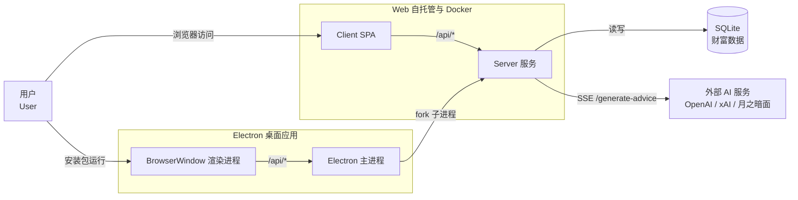
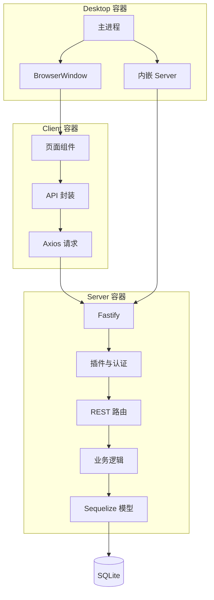
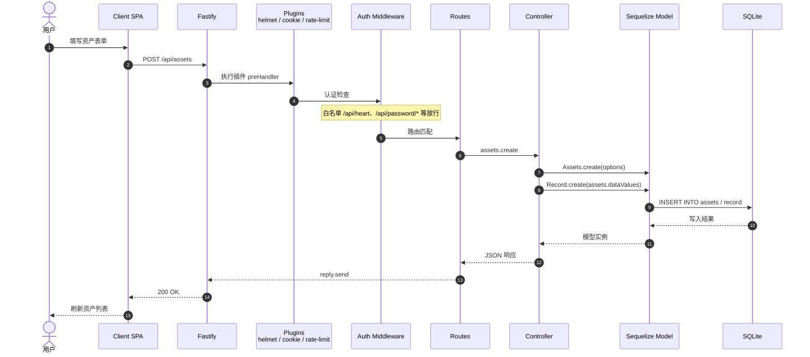
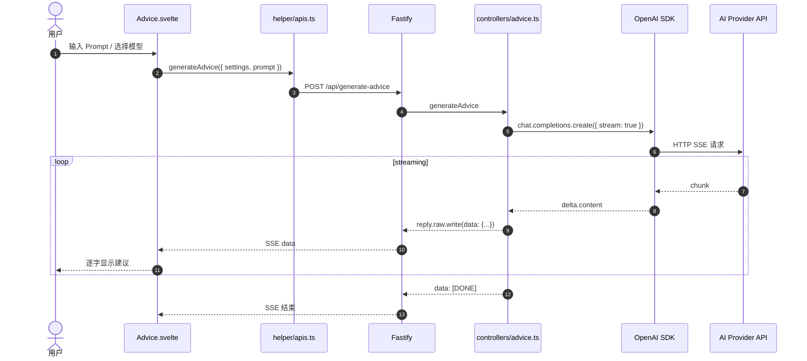
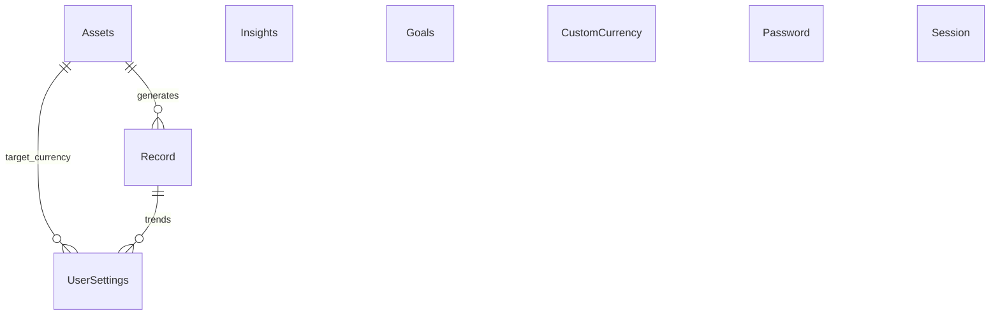

# 生财有迹（Wealth Tracker）架构说明

本文档从整体视角梳理「生财有迹」的仓库结构、技术栈、部署形态与核心数据流，并配合 Mermaid 图表帮助快速理解系统。

## 1. 项目概览

「生财有迹」是一款面向个人用户的资产管理分析工具，采用 **Monorepo** 组织方式：

| 包 | 技术栈 | 职责 |
| --- | --- | --- |
| `client/` | Svelte 4 + Vite + TailwindCSS + Flowbite-Svelte + Routify | 浏览器端单页应用（SPA），负责界面、图表、国际化 |
| `server/` | Fastify 4 + Sequelize + SQLite3 + TypeScript | REST API 与静态资源服务，负责业务逻辑与数据持久化 |
| `desktop/` | Electron + TypeScript | 桌面端壳，将 server 作为子进程嵌入，加载 client 构建产物 |

- 包管理：`pnpm workspaces` + `lerna`
- 构建：根目录 `yarn build` 会先构建 client（输出到 `server/public`），再编译 server
- AI 能力：通过 OpenAI 兼容接口（支持 OpenAI / xAI / 月之暗面等）以 SSE 流式返回财务建议

## 2. 系统上下文图

下图展示用户、三种部署形态、数据存储与外部 AI 服务之间的关系。



## 3. 容器与组件架构

下图细化三大容器内部的关键模块及其交互方式。



> 各容器对应的关键源码目录/文件：Client 为 `routes/`、`helper/apis.ts`、`helper/ajax.ts`；Server 为 `register.ts`、`middleware/auth.ts`、`routes/`、`controllers/`、`models/`；Desktop 为 `main.ts`、`server.ts`、`window.ts`。

## 4. 服务端请求处理流程

以「新增一条资产记录」为例，展示一次完整的请求生命周期。



## 5. AI 财务建议数据流

客户端通过 SSE 流式消费 AI 建议，实现逐字渲染效果。



## 6. 目录结构速查

```
wealth-tracker/
├── client/                 # Svelte 前端
│   ├── src/
│   │   ├── main.ts         # 应用入口
│   │   ├── App.svelte      # 根组件、路由初始化
│   │   ├── routes/         # 页面路由组件
│   │   ├── components/     # 可复用 UI / 图表组件
│   │   ├── helper/         # API、工具函数、常量
│   │   ├── stores.ts       # 全局状态
│   │   └── lang/           # 多语言资源
│   └── vite.config.*       # Vite 构建配置
├── server/                 # Fastify 后端
│   ├── src/
│   │   ├── index.ts        # 服务入口：Sequelize + Fastify 初始化
│   │   ├── register.ts     # Fastify 插件注册
│   │   ├── routes/         # REST 路由定义
│   │   ├── controllers/    # 业务控制器
│   │   ├── models/         # Sequelize 数据模型
│   │   ├── middleware/     # 认证等中间件
│   │   └── helper/         # 运行时配置、工具函数
│   ├── data/               # SQLite 默认存储目录
│   └── public/             # client 构建产物挂载目录
├── desktop/                # Electron 桌面壳
│   ├── src/
│   │   ├── main.ts         # Electron 主进程入口
│   │   ├── server.ts       # fork 内嵌 server
│   │   ├── paths.ts        # 运行时路径（userData / serverRoot）
│   │   ├── window.ts       # 主窗口创建
│   │   └── preload.ts      # 安全 IPC 预加载脚本
│   └── assets/             # 图标等资源
├── docker-compose.yml      # Docker Compose 部署配置
├── Dockerfile              # 基于 oven/bun 的镜像
├── lerna.json              # Lerna 配置
├── pnpm-workspace.yaml     # pnpm 工作区
└── README.md               # 项目说明
```

## 7. 关键源码入口索引

| 功能 | 入口文件 |
| --- | --- |
| 前端应用启动 | `client/src/main.ts` |
| 前端路由与初始化 | `client/src/App.svelte` |
| 前端 API 封装 | `client/src/helper/apis.ts` |
| 后端服务启动 | `server/src/index.ts` |
| 插件与中间件注册 | `server/src/register.ts` |
| 路由聚合 | `server/src/routes/index.ts` |
| 认证中间件 | `server/src/middleware/auth.ts` |
| AI 建议 | `server/src/controllers/advice.ts` |
| 数据模型 | `server/src/models/*.ts` |
| 桌面端主进程 | `desktop/src/main.ts` |
| 桌面端内嵌服务 | `desktop/src/server.ts` |
| 运行时路径 | `desktop/src/paths.ts` |

## 8. 部署模式对照

| 维度 | Web / pm2 | Docker | Electron 桌面端 |
| --- | --- | --- | --- |
| 前端产物位置 | `server/public` | 镜像内 `/app/public` | 打包到 `server/public` |
| 服务端进程 | `pm2` 管理 Node/Bun | 容器内 `bun dist/index.js` | Electron fork 子进程 |
| 监听地址 | `HOST`（默认 `0.0.0.0`） | `0.0.0.0:8888` | `127.0.0.1` 动态端口 |
| SQLite 位置 | `server/data/wealth_tracker.sqlite` | 挂载卷 `/app/data` | OS `userData/wealth_tracker.sqlite` |
| 访问方式 | 浏览器访问 IP/域名 | 浏览器访问宿主机端口 | 本地应用窗口 |
| 构建命令 | `yarn build && npm run start` | `yarn build && docker build` | `yarn desktop:build` |

## 9. 数据模型关系

核心实体及其作用：

- **Assets**：当前各类资产的最新快照，`type` 为主键，记录金额、币种、风险、流动性、标签等。
- **Record**：资产历史记录，每次新增或修改资产时同步写入，用于趋势分析。
- **Insights**：用户记录的投资理财见解，支持富文本。
- **Goals**：财务目标。
- **UserSettings**：用户偏好设置（如目标货币、AI 配置）。
- **CustomCurrency**：自定义货币与汇率。
- **Password / Session**：密码保护与会话管理。



## 10. 注意事项

- 前端所有 API 调用均使用相对路径 `/api/*`，保证 Web 与 Desktop 共用同一套 client 代码。
- 桌面端运行时数据必须存放在 OS `userData` 目录，避免写入安装目录或 `server/data/`。
- 服务端启动时会执行 Sequelize `sync()` 并做必要的向后兼容迁移（如添加 `tags` 列、处理历史 liability 符号）。
- AI 建议依赖外部 API Key，建议在 `UserSettings` 中配置，避免在代码或镜像中硬编码密钥。
